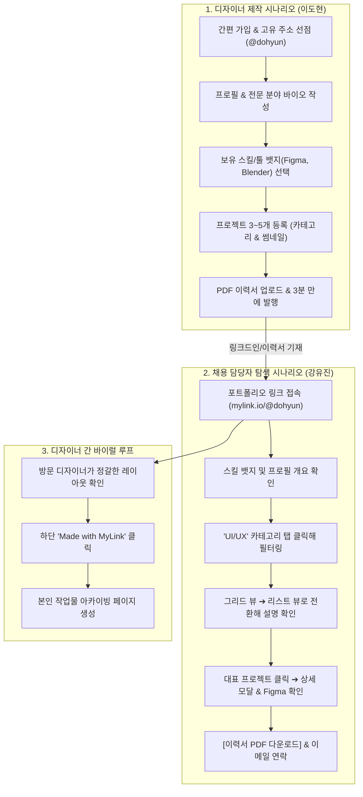

# [PRD] 마이링크 (MyLink) 제품 요구사항 정의서
## — 디자이너를 위한 올인원 포트폴리오 아카이빙 서비스 —

> **문서 버전:** v2.0.0 (서비스 타겟 피벗: 인플루언서 ➔ 디자이너 포트폴리오 아카이빙 전면 개편)  
> **작성일:** 2026-10-02  
> **상태:** 기획 확정 (Approved for Development)  
> **프로젝트:** MyLink (Next.js + Tailwind CSS + shadcn/ui(TDS Style) 기반 디자이너 포트폴리오 서비스)  

---

## 1. 프로젝트 개요 (Overview)

### 1.1 서비스 소개
**마이링크 (MyLink)**는 모든 분야(UI/UX, 그래픽, 브랜딩, 제품, 일러스트 등)의 디자이너들이 자신의 작업물과 커리어를 가장 세련되고 간결하게 아카이빙하고 공유할 수 있는 **디자이너 특화 올인원 포트폴리오 아카이빙 및 멀티 링크 서비스**입니다.  
무겁고 관리가 어려운 개인 웹사이트 구축이나 파편화된 외부 링크(Figma, Behance, Dribbble, Notion, LinkedIn)의 한계를 극복하고, 채용 담당자와 클라이언트에게 최적화된 단일 모바일 반응형 페이지(`mylink.io/@designer`)를 제공합니다.

### 1.2 핵심 가치 제안 (Value Proposition)
1. **3분 완성 초간편 포트폴리오:** 개발 지식 없이도 프로젝트 썸네일, 설명, 사용 툴을 등록하여 감각적인 포트폴리오 페이지 구축.
2. **다채로운 뷰 모드 & 필터링:** 방문자 취향에 따라 **그리드 뷰 ↔ 리스트 뷰 전환 토글** 및 **카테고리 필터(UI/UX, Branding 등)** 제공.
3. **하이브리드 프로젝트 뷰어:** 페이지 내에서 **상세 팝업 모달(작업 배경, 기여도, 이미지)** 확인 후, 필요 시 외부 원본(Figma 프로토타입, Behance)으로 즉시 연결.
4. **원클릭 이력서 다운로드 & 협업 연결:** PDF 포트폴리오/이력서 다운로드 및 직관적인 연락 채널 제공.
5. **shadcn/ui + 토스 디자인 시스템(TDS)의 정갈한 미학:** 과도한 장식을 배제하고 디자이너의 작업물이 가장 돋보이도록 설계된 미니멀 UI.

---

## 2. 타겟 사용자 및 사용자 시나리오 (Target & User Scenarios)

### 2.1 핵심 타겟 페르소나
- **Primary (크리에이터/제작자):**  
  - **이도현 (28세, 4년차 프로덕트/그래픽 디자이너)**
  - **상황:** 이직 준비 및 프리랜서 외주 프로젝트를 위해 포트폴리오를 정리해야 하나, 노션은 모바일 뷰가 투박하고 개인 포트폴리오 웹사이트를 직접 코딩하기엔 시간이 부족함. 비핸스, 피그마 링크, PDF 이력서가 제각각 흩어져 있음.
- **Secondary (방문자/소비자):**  
  - **강유진 (34세, IT 스타트업 디자인 리드 & 채용 담당자)**
  - **상황:** 수많은 디자이너의 지원서를 검토할 때, 모바일/웹에서 빠르고 보기 쉽게 정리된 프로젝트 썸네일과 실제 프로토타입 링크, PDF 이력서를 1분 이내에 훑어보고 싶음.

---

### 2.2 사용자 시나리오 (User Scenarios)



#### 시나리오 1: [디자이너 온보딩] 3분 만에 올인원 포트폴리오 허브 만들기
* **행동:** 디자이너 도현은 마이링크에 접속해 `@dohyun` 핸들을 생성하고, 프로필 사진과 "사용자 경험을 고민하는 프로덕트 디자이너" 소개글을 입력합니다.
* 자주 쓰는 스킬 뱃지(Figma, Protopie, React)를 선택하고, 최근 마친 3개의 프로젝트(토스 클론 앱, 브랜드 리뉴얼, 3D 아이콘 팩)를 등록한 뒤 카테고리를 분류합니다.
* 최신 PDF 이력서 링크를 등록하고 완료 버튼을 누르자, 모바일과 데스크톱 모두에서 완벽하게 반응하는 포트폴리오 웹페이지가 즉시 완성됩니다.

#### 시나리오 2: [채용 담당자 탐색] 원스톱 프로젝트 검토 및 채용 제안
* **행동:** 채용 담당자 유진은 지원서의 `mylink.io/@dohyun` 링크를 클릭합니다.
* 상단에서 도현의 핵심 스킬과 전문 분야를 5초 만에 파악하고, **[UI/UX] 카테고리 탭**을 눌러 회사 직무와 연관된 프로젝트만 모아봅니다.
* **[목록/카드 토글 버튼]**을 눌러 상세 요약 리스트 형태로 바꾼 뒤 관심 있는 앱 디자인 프로젝트를 탭합니다.
* 페이지를 벗어나지 않고 **프로젝트 상세 모달**이 열려 기여도(100%), 디자인 의도, 고해상도 목업을 확인하고, 모달 내 **[Figma 프로토타입 바로가기]** 버튼을 통해 실제 인터랙션을 테스트합니다.
* 만족한 유진은 상단의 **[이력서 다운로드]**를 받아 사내 공유하고, [이메일] 버튼으로 면접 제안을 보냅니다.

---

## 3. Phase 1 핵심 개발 범위 (Current MVP Scope)

### 3.1 제외 기능 (Out of Scope for Phase 1)
- ❌ 회원가입 / 로그인 / 서버 인증 (Phase 3)
- ❌ 관리자 대시보드 화면 (Phase 2)
- ❌ 방문자 통계(PV/클릭수 트래킹) (Phase 3)
- ❌ 서버 데이터베이스 및 파일 스토리지 서버 (Phase 3)
- ❌ 기존 인플루언서용 블록: **공구 달력, 오프라인 팝업 카카오 지도, 배너 광고 제외**

### 3.2 집중 개발 기능 (In Scope for Phase 1)
- ✅ **로컬 스토리지 데이터 관리자 (`storage.ts`):** 디자이너 포트폴리오 Mock 데이터 초기화 및 get/set 유틸리티
- ✅ **shadcn/ui + 토스 디자인 시스템(TDS) 통합:**
  - `components.json` 설정 기반 `@/components/ui/*` 활용
  - 토스 블루 포인트(`#3182F6`), Grey-900 텍스트, Grey-100 서피스, 16px 곡률
- ✅ **디자이너 프로필 헤더:**
  - 아바타 이미지, 디자이너 이름, 직함/전문 분야 한 줄 바이오
  - **공식 소셜 로고 버튼 바:** Behance, LinkedIn, GitHub, Instagram, Email 등 각 소셜의 공식 로고가 들어있는 원형 아이콘 버튼
  - **이력서/포트폴리오 PDF 다운로드 CTA 버튼**
- ✅ **프로젝트 카테고리 필터 탭 (`CategoryTabs`):**
  - All(전체), UI/UX, Branding, Graphic, 3D/Motion 필터링
- ✅ **뷰 모드 토글 컨트롤 (`ViewModeToggle`):**
  - **그리드 뷰 (2열 비주얼 썸네일 카드)** ↔ **리스트 뷰 (1열 와이드 상세 요약 카드)** 실시간 전환
- ✅ **프로젝트 쇼케이스 카드 (`ProjectCard`):**
  - **팀/개인 프로젝트 구분 명시:** 각 프로젝트 카드에 '팀 프로젝트' / '개인 프로젝트' 뱃지 노출
  - 썸네일 이미지, 프로젝트 제목, 요약 설명, 카테고리 뱃지, 사용 툴 아이콘
- ✅ **사용 도구 숙련도 프로그레스 바 (`ToolProficiencyBars`):**
  - **배치 위치:** 프로젝트 카드와 경력 및 활동 카드 사이
  - 뱃지 형태가 아닌, 도구 로고와 도구명(Figma, Protopie, Adobe CC, Blender 등) 좌측 노출 및 숙련도 퍼센트(%)와 부드러운 프로그레스 바 표시
- ✅ **하이브리드 프로젝트 상세 모달 (`ProjectDetailModal`):**
  - 팀/개인 프로젝트 여부 및 기여도 명시
  - **스크롤바 없는 다이얼로그:** 기본 브라우저 스크롤바를 완전히 제거하고, 상단 읽기 진행률 라인과 하단 그라디언트 페이드 및 인터랙티브 스크롤 안내 힌트로 스크롤 가능 여부 표현
  - 외부 원본 링크 액션: Figma 프로토타입 열기, Behance 상세 케이스 스터디 바로가기
- ✅ **경력 및 활동 타임라인 블록 (`CareerTimeline`):**
  - 재직 회사, 수상 이력, 주요 전시/프로젝트 연도별 타임라인

---

## 4. 로컬 스토리지 데이터 구조 (Storage Schema)

브라우저의 `localStorage` 키 `mylink_designer_portfolio`에 저장되는 데이터 스키마:

```typescript
// types/portfolio.ts

export type ProjectCategory = 'all' | 'uiux' | 'branding' | 'graphic' | 'motion';
export type ViewMode = 'grid' | 'list';

export interface SocialLinks {
  behance?: string;
  dribbble?: string;
  linkedin?: string;
  github?: string;
  email?: string;
  instagram?: string;
}

export interface ProjectItem {
  id: string;
  title: string;
  category: ProjectCategory;
  categoryLabel: string; // 예: "UI/UX Design"
  summary: string;
  thumbnailUrl: string;
  detailImages?: string[];
  period: string; // 예: "2026.03 ~ 2026.05"
  role: string; // 예: "Product Lead (기여도 80%)"
  tools: string[]; // ["Figma", "Protopie"]
  description: string;
  externalLink?: {
    label: string; // 예: "Figma Prototype"
    url: string;
  };
  orderIndex: number;
}

export interface CareerItem {
  id: string;
  period: string; // 예: "2024 ~ Present"
  title: string; // 예: "Product Designer"
  organization: string; // 예: "Viva Republica (Toss)"
  description?: string;
}

export interface DesignerProfileData {
  handle: string; // "dohyun"
  name: string; // "이도현"
  roleTitle: string; // "Product & Visual Designer"
  bio: string; // "문제를 시각적으로 해결하는 4년차 프로덕트 디자이너입니다."
  avatarUrl: string;
  resumePdfUrl?: string; // 이력서 PDF 다운로드 링크
  socialLinks: SocialLinks;
  skills: string[]; // ["Figma", "Photoshop", "Illustrator", "Blender", "HTML/CSS"]
  projects: ProjectItem[];
  careers: CareerItem[];
}
```

---

## 5. UI / UX 및 컴포넌트 상세 명세 (shadcn/ui + TDS)

### 5.1 프로필 헤더 (Profile Header)
- **아바타:** 96x96px 원형, 부드러운 화이트 링 테두리 (`shadcn Avatar`)
- **이름 & 직함:** Pretendard Bold 22px (`grey-900`), 직함 14px SemiBold (`#3182F6`)
- **전문 바이오:** TDS `grey-700`, 14px, 깔끔한 2줄 요약
- **공식 소셜 로고 버튼 바:** 비핸스, 링크드인, 깃허브, 인스타그램, 이메일 등 각 소셜의 공식 브랜드 벡터 로고가 삽입된 원형 아이콘 버튼 (`rounded-full w-10 h-10 border border-grey-200 bg-white hover:border-brand`)
- **CTA 버튼:** `shadcn Button` - **[📄 Resume / 이력서 다운로드]** (Primary Outline 또는 Soft Blue)

### 5.2 프로젝트 카테고리 필터 & 뷰 모드 토글 바
- **좌측:** `All`, `UI/UX`, `Branding`, `Graphic`, `3D/Motion` 가로 스크롤 필터
- **우측:** `그리드 뷰 (⊞)` ↔ `리스트 뷰 (☰)` 원클릭 아이콘 토글 스위치

### 5.3 프로젝트 쇼케이스
- **팀/개인 프로젝트 명시:** 각 프로젝트 카드에 '팀 프로젝트' / '개인 프로젝트' 뱃지 필수 표시
- **그리드 뷰:** 2열 배치, 1:1 또는 4:3 비율의 고해상도 썸네일 + 하단 타이틀 & 카테고리 태그
- **리스트 뷰:** 1열 와이드 카드, 좌측 썸네일(16:9) + 우측/하단 타이틀, 요약 설명, 사용 툴 뱃지
- **터치 피드백:** 탭 시 `scale-[0.98]` 미세 축소 및 카드 섀도우 반응

### 5.4 사용 도구 숙련도 프로그레스 바 (`ToolProficiencyBars`)
- **배치 위치:** **프로젝트 쇼케이스 카드와 경력 및 활동 카드 사이**에 배치
- **구성:** 뱃지 형태 대신 각 도구(Figma, Protopie, Adobe CC, Blender, React)의 공식 로고와 도구명을 좌측에 배치하고, 우측에 숙련도 퍼센트(%) 수치 및 부드러운 프로그레스 바(Progress Bar) 표시

### 5.5 하이브리드 프로젝트 상세 모달 (`shadcn Dialog`)
- **팀/개인 프로젝트 구분 및 기여도 표시:** 프로젝트 타입, 참여 기간, 기여도 칩
- **스크롤바 없는 다이얼로그 설계:** 브라우저 기본 스크롤바를 완전히 숨김 처리(`scrollbar-none`)
- **대체 스크롤 표현 인터랙션:**
  1. 상단 미세 읽기 진행률(Progress Line)을 통해 현재 스크롤 위치 시각화
  2. 하단 그라디언트 페이드 오버레이와 바운스 안내 힌트("아래로 스크롤하여 더 보기")를 제공하며, 최하단 도달 시 자연스럽게 소멸
- 모달 하단 고정 액션: **[Figma 프로토타입 확인하기 ↗]**, **[Behance 케이스스터디 ↗]**

### 5.6 경력 타임라인 (`shadcn Card`)
- 미니멀 타임라인: 연도/기간, 소속 회사/프로젝트명, 역할 간단 설명

---

## 6. 기술 스택 명세 (Tech Stack)

| 구분 | 도입 기술 | 세부 사유 및 역할 |
|---|---|---|
| **디자인 시스템** | **shadcn/ui + TDS (Toss Design System)** | 컴포넌트 아키텍처 + `design.md`의 토스 디자인 토큰 완벽 융합 |
| **프론트엔드 프레임워크** | **Next.js 16 (App Router)** | 빠른 SSR/ISR을 통한 프로필 로딩 최적화, Server Components |
| **언어** | **TypeScript 5.x** | 포트폴리오 데이터 모델의 엄격한 타입 안정성 |
| **스타일링** | **Tailwind CSS v4 + TDS Tokens** | 토스 블루(`#3182F6`), Grey-900, Grey-100 등 시맨틱 CSS 변수 연동 |
| **아이콘 라이브러리** | **Lucide React** | Grid, List, Download, ExternalLink 등 공식 표준 아이콘 |
| **클래스 병합 유틸** | **cn (`clsx` + `tailwind-merge`)** | 조건부 클래스네임 및 tailwind 중복 클래스 완벽 해결 |
| **데이터 영속화 (Phase 1)** | **브라우저 LocalStorage** | 서버 없이 클라이언트 독립형으로 빠른 포트폴리오 렌더링 검증 |
| **백엔드 (Phase 3 예정)** | **Supabase (PostgreSQL 15)** | Auth, Postgres DB, Storage (이미지/PDF 업로드) |

---

## 7. 개발 실행 계획 (Phase 1 Action Items)

1. **타입 정의 및 스토리지 유틸 (`src/types/portfolio.ts`, `src/lib/portfolioStorage.ts`)**
   - DesignerProfileData, ProjectItem, CareerItem 인터페이스 정의
   - 디자이너 전용 고품질 Mock 데이터(UI/UX, 브랜딩, 3D 프로젝트 4개 포함) 세팅
2. **shadcn/ui 필수 컴포넌트 추가 (`dialog`, `badge`, `tabs`, `avatar`, `card`)**
3. **포트폴리오 전용 컴포넌트 구현 (`src/components/portfolio/...`)**
   - `ProfileHeader.tsx` (아바타, 직함, 소셜 텍스트 바, 이력서 다운로드 CTA)
   - `SkillChips.tsx` (스킬 & 툴 뱃지 목록)
   - `FilterAndToggleBar.tsx` (카테고리 탭 + 그리드/리스트 뷰 토글)
   - `ProjectCard.tsx` (그리드/리스트 적응형 카드)
   - `ProjectDetailModal.tsx` (하이브리드 상세 팝업 + 외부 원본 링크)
   - `CareerTimeline.tsx` (경력 및 전시 이력)
4. **포트폴리오 메인 페이지 조립 (`src/app/page.tsx`)**
   - 모바일 & 데스크톱 완벽 반응형 뷰어 완성
